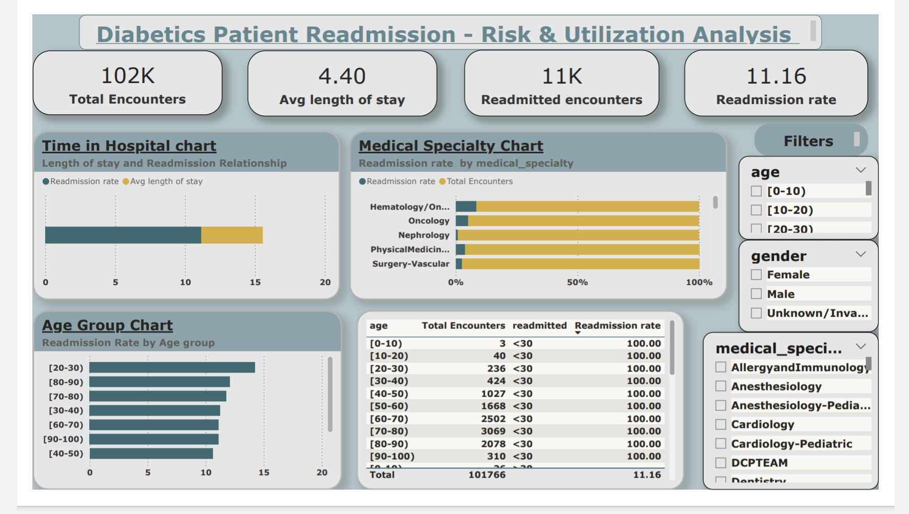

# Diabetes Patient Readmission Risk Analysis

## Overview
Analyzed 101,766 diabetic patient encounters from 130 US hospitals to find patterns behind 30-day hospital readmissions. Built the full analysis across **SQL, Python, R, SAS, and Power BI** — cleaning, KPI calculation, risk stratification, and an interactive dashboard.

---

## Dataset
- **Source:** Kaggle — Diabetes 130-US Hospitals (1999–2008)
- **Link:** https://www.kaggle.com/datasets/brandao/diabetes
- **Raw size:** 101,766 hospital encounters across 10 years

Columns used: `patient_nbr`, `age`, `admission_type_id`, `discharge_disposition_id`, `time_in_hospital`, `number_diagnoses`, `change`, `readmitted`

---

## What I did
- Recoded `?` placeholder values to missing, dropped columns with excessive missingness (`weight`, `payer_code`, `medical_specialty`)
- Deduplicated to first encounter per patient, and **excluded expired/hospice discharges** (codes 11, 13, 14, 19, 20, 21) before computing readmission rates — patients who died or entered hospice can't be readmitted, so leaving them in would understate the true rate
- Calculated readmission KPIs, age-group and admission-type breakdowns, and length-of-stay patterns
- Built a rule-based high-risk flag (elderly + emergency admission + stay ≥7 days) — descriptive risk stratification, not a predictive ML model
- Used window functions in SQL (`RANK() OVER`, running totals) for patient-level and cohort-level ranking
- Built a Power BI dashboard with filters for age, gender, and medical specialty
- Ported the full pipeline across SQL, Python (Pandas/Matplotlib), R (dplyr/ggplot2), and SAS (PROC SQL/PROC MEANS/PROC SGPLOT)

---

## Readmission Definition
Readmission rate is reported using the **strict 30-day definition** (`readmitted == '<30'`) as the headline metric everywhere — README, SQL, Python, R, and SAS all use this same definition. A broader "any readmission" metric (`readmitted <> 'NO'`, includes >30-day readmits) is also available in the SQL file, labeled separately so it isn't confused with the 30-day figure.

---

## Dashboard KPIs
| Metric                              | Value     |
| ------------------------------------ | --------- |
| Raw Encounters                       | 101,766   |
| Unique Patients (after dedup)        | 71,518    |
| Encounters After Cleaning*           | 69,973    |
| Average Length of Stay               | 4.27 days |
| Readmitted Encounters (30-day)       | 6,277     |
| Readmission Rate (30-day)            | 8.97%     |
| Readmission Rate (any, broad def)    | 40.73%    |

*After deduplication (first encounter per patient) and exclusion of expired/hospice discharges.

---

## Key Findings
- Age group and admission-type patterns in readmission rate (`readmission_by_age.png`, `readmission_by_admission.png`)
- Length of stay alone was not a strong predictor — discharge planning plays a bigger role
- The high-risk subgroup (elderly + emergency admission + stay ≥7 days) shows a meaningfully higher readmission rate than the overall population

---

## Dashboard Preview



## Files
```
├── diabetes.sql                 — SQL queries (readmission KPIs, age/specialty breakdowns, window functions)
├── diabetic_analysis.py         — Python EDA script (cleaning, KPI calc, visualizations)
├── R file                       — R port (dplyr/ggplot2)
├── SAS file                     — SAS port (PROC SQL/PROC MEANS/PROC SGPLOT)
├── diabetes.bi.pbix             — Power BI dashboard
├── diabetes.csv.xlsx            — raw dataset
├── readmission_by_age.png       — Readmission rate by age group chart
├── readmission_by_admission.png — Readmission rate by admission type chart
├── IMG_20260213_232330.jpg      — Power BI dashboard screenshot
```
