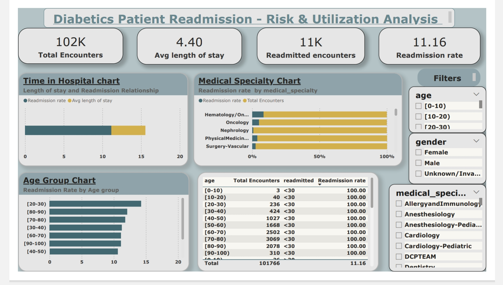

# Diabetes Patient Readmission Risk Analysis

## Overview

This project analyzes hospital records of diabetic patients to understand patterns associated with hospital readmission and healthcare utilization.

The analysis was performed using **Python, SQL and Power BI**. Python was used for data cleaning and exploratory analysis, SQL was used to query and analyze the hospital data, and Power BI was used to create an interactive dashboard for reporting key metrics and trends.

The main focus of the project is **30-day hospital readmission**, along with factors such as age, gender, admission type, length of stay, previous inpatient visits, medication count and medical specialty.


---

## Dataset
- **Source:** Kaggle — Diabetes 130-US Hospitals (1999–2008)
- **Link:** https://www.kaggle.com/datasets/brandao/diabetes
- **Raw size:** 101,766 hospital encounters across 10 years

Columns used: `patient_nbr`, `age`, `admission_type_id`, `discharge_disposition_id`, `time_in_hospital`, `number_diagnoses`, `change`, `readmitted`


### Dataset Details

- 101,766 hospital encounters
- 50 variables
- Patient demographic information
- Admission and discharge information
- Hospital stay information
- Diagnosis information
- Medication information
- Previous hospital utilization
- Readmission information

### Important Variables

- `patient_nbr` - Patient identifier
- `age` - Patient age group
- `gender` - Patient gender
- `admission_type_id` - Type of admission
- `discharge_disposition_id` - Discharge information
- `time_in_hospital` - Number of days spent in hospital
- `number_inpatient` - Number of previous inpatient visits
- `num_medications` - Number of medications
- `medical_specialty` - Medical specialty
- `readmitted` - Readmission status

---

## Project Objective

The main objective is to understand patterns in diabetic patient readmission and hospital utilization.

The analysis looks at:

- Overall 30-day readmission
- Readmission across age groups
- Readmission by gender
- Readmission by admission type
- Length of hospital stay and readmission
- Previous inpatient visits and readmission
- Medication count and readmission
- Readmission across medical specialties
- Hospital utilization patterns

---

## Data Cleaning & Preparation

Python was used to prepare the data before analysis.

The following steps were performed:

- Loaded the hospital dataset using Pandas
- Checked the dataset structure and initial records
- Replaced `?` values with missing values
- Removed columns with a large amount of missing information:
  - `weight`
  - `payer_code`
  - `medical_specialty`
- Removed duplicate patient records by keeping the first encounter for each patient
- Excluded discharge records associated with death or hospice:
  - 11
  - 13
  - 14
  - 19
  - 20
  - 21
- Created a 30-day readmission indicator based on the `readmitted` variable

After these cleaning steps, the Python analysis dataset contained approximately **69,973 records**.

---

## Python Analysis

Python was used for data cleaning, transformation and exploratory analysis.

### 30-Day Readmission

A 30-day readmission flag was created using:

```text
readmitted = '<30'


## Dashboard Preview



